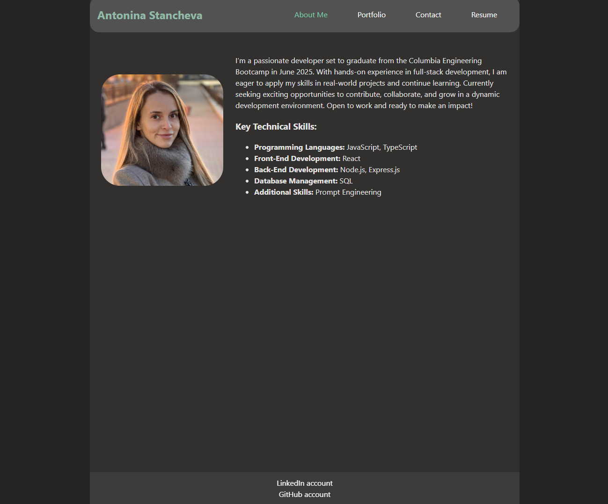
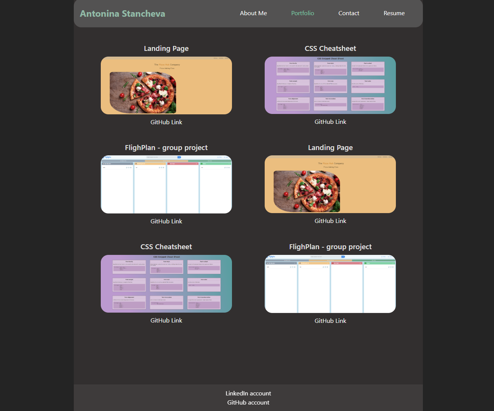
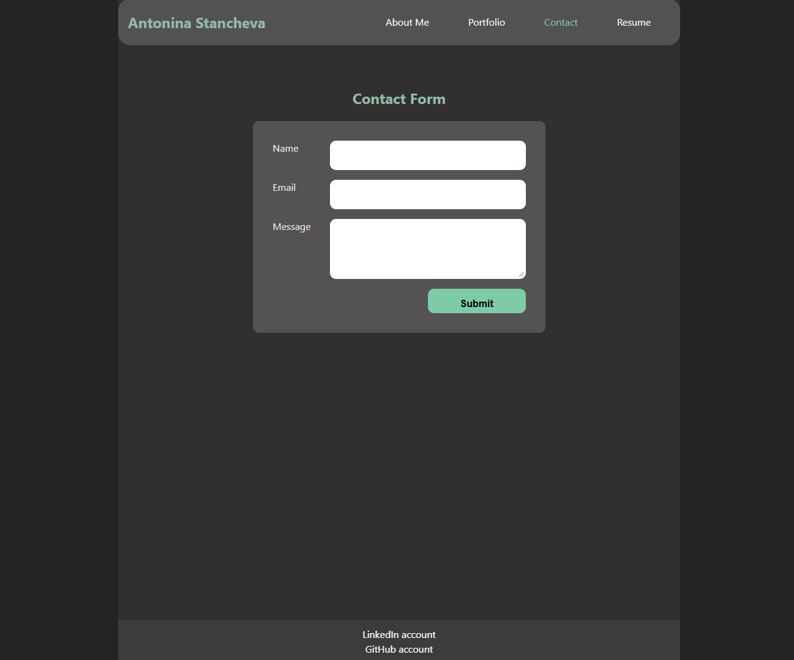
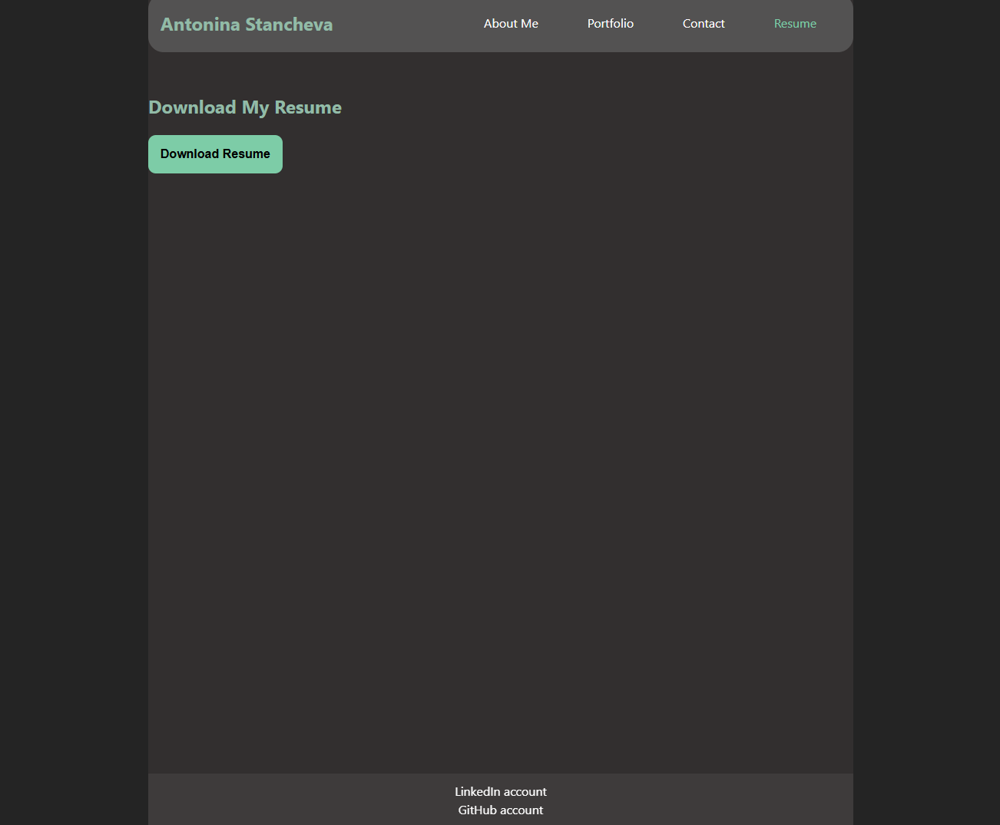

# Personal Portfolio of Antonina Stancheva

<b>Deployed website:</b> https://antonina-stancheva-portfolio.netlify.app/

## Header
The navigation bar has four different clickable links to About Me, Porfolio, Contact and Resume pages

## Footer
On the footer there are two links - for LinkedIn Account and GitHub Repository.

## About Me
Home page is the "About Me" page. It consists of a short bio and a personal photo.

## Portfolio
On the "Portfolio" page are displayed 6 personal and group projects. If the user clicks on one of the images of the projects, new tab will be opened with the deployed project. ABove the image of the project you can the title of the project and under the image of the project you will see a clickable GitHub link to the repository of the project.

## Contact
Short contact form if you want to leave a message to Antonina.

## Resume
There is a button, which user can click and a Resume of Antonina will be automatically downloaded to the user's computer.

